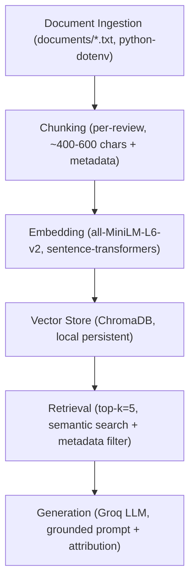

# Project 1 Planning: The Unofficial Guide

> Write this document before you write any pipeline code.
> Your spec and architecture diagram are what you'll use to direct AI tools (Claude, Copilot, etc.) to generate your implementation — the more specific they are, the more useful the generated code will be.
> Update the Retrieval Approach and Chunking Strategy sections if you change your approach during implementation.
> Update this file before starting any stretch features.

---

## Domain

Student experiences with specific professors and courses at UC Santa Cruz — what teaching style, workload, grading, and exam difficulty are actually like in each class, and which instructors students recommend or avoid. This is hard to find through official channels because the registrar's catalog and the Student Experience of Teaching Survey (SET) summaries describe course content and aggregate numbers, not the candid, instructor-specific advice students trade informally. The real signal lives scattered across Rate My Professors reviews, the student-built Slugtistics GPA/review site, and r/UCSC threads — sources no single official page aggregates.

---

## Documents

<!-- List your specific sources: URLs, subreddit names, forum threads, or file descriptions.
     Aim for at least 10 sources that together cover different subtopics or perspectives within your domain. -->

| #   | Source                               | Description                                                          | URL or location                                                            |
| --- | ------------------------------------ | -------------------------------------------------------------------- | -------------------------------------------------------------------------- |
| 1   | RMP — UCSC school hub                | Aggregated ratings for all UCSC professors                           | https://www.ratemyprofessors.com/school/1078                               |
| 2   | RMP — Ethan Miller (CS)              | Reviews for a high-profile CS prof with polarized opinions           | https://www.ratemyprofessors.com/professor/136264                          |
| 3   | RMP — A.M. Darke (Art/Games)         | Reviews covering an Art & Games dept professor                       | https://www.ratemyprofessors.com/professor/2463375                         |
| 4   | RMP — Ryan Coonerty (Politics)       | Reviews for a Politics/Community Studies prof                        | https://www.ratemyprofessors.com/professor/439427                          |
| 5   | RMP — Jesse Kass (Math)              | Reviews for a well-regarded Math dept professor                      | https://www.ratemyprofessors.com/professor/2895784                         |
| 6   | RMP — Anne Sizemore (Chem)           | Reviews for an Organic Chemistry professor                           | https://www.ratemyprofessors.com/professor/2989548                         |
| 7   | RMP — Scott Anderson                 | Reviews covering extra credit and grading style                      | https://www.ratemyprofessors.com/professor/2319462                         |
| 8   | RMP — Edward Migliore (Math, online) | Reviews for an online Math instructor                                | https://www.ratemyprofessors.com/professor/218123                          |
| 9   | RMP — Steven Owen                    | Reviews for a UCSC professor (diverse dept coverage)                 | https://www.ratemyprofessors.com/professor/2346100                         |
| 10  | Slugtistics                          | Student-built UCSC class search with GPA data and instructor reviews | https://slugtistics.com/about                                              |
| 11  | UCSC IRAPS grade data                | Official grade distributions by course and term                      | https://iraps.ucsc.edu/campus-data/student-data/grades-by-course-and-term/ |
| 12  | r/UCSC subreddit                     | Community threads on professor recommendations and easy GEs          | https://www.reddit.com/r/UCSC/                                             |

---

## Chunking Strategy

**Chunk size:** One chunk per individual review (review-level), targeting ~400–600 characters. Fixed-size fallback of 512 tokens for long-form sources (Slugtistics about page, r/UCSC threads).

**Overlap:** ~50 characters (≈1 sentence) on the fixed-size fallback only. Per-review chunks get no overlap — they are atomic units.

**Reasoning:** RMP and Slugtistics reviews are short (1–3 sentences, ~50–150 words) and self-contained. A review is the natural retrieval unit — fixed-size splitting would either merge two unrelated reviews about different professors or sever one opinion mid-sentence, polluting the embedding. Chunking at review boundaries keeps each opinion attributable to one professor. Preprocessing before chunking: strip HTML/nav boilerplate, drop empty or exact-duplicate reviews. Each chunk stores metadata: professor name, department, source URL, and star rating (where available).

---

## Retrieval Approach

**Embedding model:** `all-MiniLM-L6-v2` via `sentence-transformers` (384-dimensional embeddings, 256-token max context). Fits short reviews without truncation, runs locally with no API cost, and loads fast enough for interactive queries.

**Top-k:** 5 — enough to aggregate multiple student opinions per professor without diluting context with off-topic chunks from other professors.

**Production tradeoff reflection:** Without cost constraints, I would weigh switching to a higher-accuracy model like `bge-large-en` or OpenAI `text-embedding-3-large`. Key tradeoffs: (1) **Context length** — `all-MiniLM-L6-v2` truncates at 256 tokens, which loses the tail of longer r/UCSC threads; a 512- or 8192-token model avoids that. (2) **Domain specificity** — generic models may underweight UCSC-specific slang or professor nicknames; a fine-tuned model on student review text would retrieve more precisely. (3) **Latency and hosting** — MiniLM runs offline with no per-query cost; API-hosted models add latency and cost but remove the need to manage local GPU/CPU resources. (4) **Multilingual support** — irrelevant here (corpus is English-only), but matters if expanding to international course review sites.

---

## Evaluation Plan

| #   | Question                                                                    | Expected answer                                                            |
| --- | --------------------------------------------------------------------------- | -------------------------------------------------------------------------- |
| 1   | Does Edward Migliore teach his UCSC math classes in an online format?       | Yes — his RMP reviews explicitly describe online/asynchronous instruction. |
| 2   | Do students mention extra-credit opportunities in Scott Anderson's reviews? | Yes — reviews reference extra credit as part of his grading.               |
| 3   | What subject does Anne Sizemore teach at UCSC?                              | Organic Chemistry (Chemistry department).                                  |
| 4   | Which academic department is Ethan Miller associated with at UCSC?          | Computer Science.                                                          |
| 5   | What department or program does A.M. Darke teach in at UCSC?                | Art & Games / Performance, Play & Design (within the Arts division).       |

---

## Anticipated Challenges

1. **Cross-review boundary contamination:** If fixed-size chunking is applied to a block of concatenated reviews, two unrelated reviews about different professors may land in the same chunk, or one review may be split across two chunks. Retrieval then returns half-context or mixed-professor signal to the LLM. Mitigation: chunk at review boundaries rather than fixed size; enforce professor-name metadata filtering at retrieval time.

2. **False consensus from sparse reviews:** Some professors (especially those added recently or outside popular departments) have only 2–3 reviews. Aggregating those can make one student's outlier experience read as consensus. Mitigation: store review count per professor as metadata and surface it in the grounded response so the LLM can hedge appropriately.

3. **Off-topic semantic retrieval on generic phrases:** Queries using phrases like "hard exams" or "tough grader" produce embeddings that match many professors, not the one being asked about. A query about Ethan Miller may retrieve top-k chunks from unrelated professors with similar review language. Mitigation: include professor name in query (or as a ChromaDB `where` metadata filter) so retrieval is scoped before semantic ranking.

---

## Architecture

---

## AI Tool Plan

<!-- For each part of the pipeline below, describe:
     - Which AI tool you plan to use (Claude, Copilot, ChatGPT, etc.)
     - What you'll give it as input (which sections of this planning.md, which requirements)
     - What you expect it to produce
     - How you'll verify the output matches your spec

     "I'll use AI to help me code" is not a plan.
     "I'll give Claude my Chunking Strategy section and ask it to implement chunk_text()
     with my specified chunk size and overlap" is a plan. -->

**Milestone 3 — Ingestion and chunking:**
- **AI tool:** Claude (claude.ai)
- **Input:** The Chunking Strategy section of this file plus a description of the JSONL input format (fields: `text`, `professor`, `dept`, `source`, `rating`)
- **Expected output:** A complete `ingest.py` with `load_records()`, `clean_text()`, `chunk_records()`, and `write_jsonl()` functions matching the per-review chunking strategy
- **Verification:** Run `python3 ingest.py` and inspect `chunks.jsonl` — confirm chunk count is ~580, each chunk has a self-containment header, no HTML entities remain, no duplicates exist

**Milestone 4 — Embedding and retrieval:**
- **AI tool:** Claude (claude.ai)
- **Input:** The Retrieval Approach section of this file, the pipeline architecture diagram, and the already-written `ingest.py` as context for the output chunk format
- **Expected output:** `embed.py` with `embed_chunks()` (batch upsert into ChromaDB), `retrieve()` (query with optional professor filter), and a `--smoke-test` CLI path that runs all 5 eval queries
- **Verification:** Run `python3 embed.py --smoke-test` — all 5 eval queries must return PASS (top-1 cosine distance < 0.5); inspect raw distance values directly in output

**Milestone 5 — Generation and interface:**
- **AI tool:** Claude (claude.ai)
- **Input:** The Grounded Generation spec (system prompt rules, distance threshold, citation format) from this file plus `embed.py` as context for the `retrieve()` interface
- **Expected output:** `generate.py` with `answer()` (full RAG pipeline: detect professor → retrieve → filter → format context → call Groq → append references) and `app.py` with a Gradio UI (textbox, answer panel, sources panel, example questions)
- **Verification:** Run each of the 5 eval questions manually through `python3 generate.py` and confirm answers are grounded with `[n]` citations; run the out-of-scope tuition query and confirm refusal without LLM call
